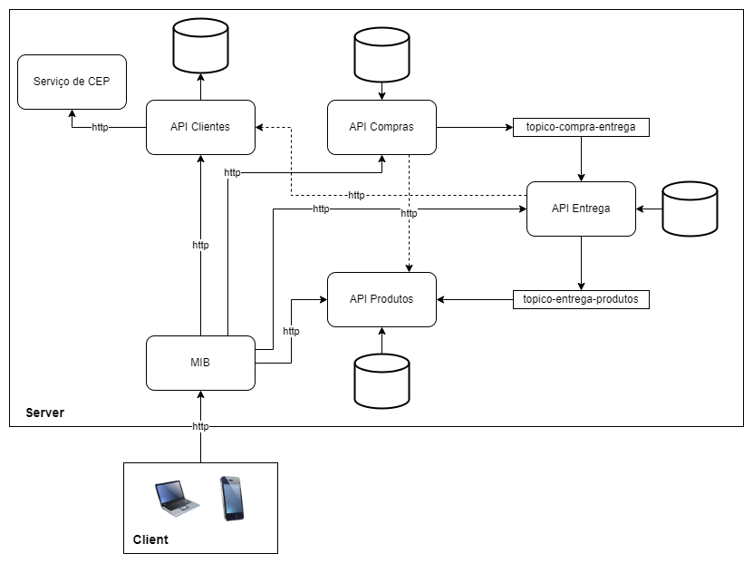

<h1> Microserviços com Kotlin </h1>

Projeto desenvolvido em treinamento em Kotlin:

Foram desenvolvidas as APIs da figura a seguir:

Principais dependências utilizadas:

- MariaDB;
- MongoDB
- RabbitMQ;
- Redis;
- Docker;
- Spring Boot/Security etc.;
- Flyway;
- 

Alguns comandos necessários (docker, etc):

docker run --name my-mongo -d -p 27017:27017 -p 28017:28017 -e MONGO_INITDB_ROOT_USERNAME=admin -e MONGO_INITDB_ROOT_PASSWORD=admin mongo:latest

shell:

docker exec -it CONTAINER mongo -u "admin" -p "admin"

Rabbit:
docker run --rm -it -p 15672:15672 -p 5672:5672 rabbitmq:3-management

http://localhost:15672/

Redis:
docker run --name my-redis -it -p 6379:6379 -d redis
docker exec -it CONTAINER redis-cli

Docker compose:
Exemplo:
docker-compose -f ARQUIVO.yaml up -d

Agradecimentos (instrutores e responsáveis pelo projeto e por algumas partes do código):
- Eduardo Kaufmann Berrio Lace Brandao
- Allan Victor de Menezes Santos
- Everton Thiago Silva Coutinho

